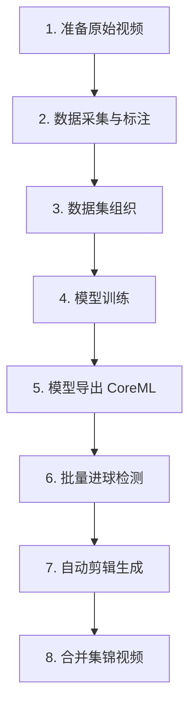

# 🏀 篮球进球检测系统 - 完整工作流程

从零开始的完整流程：数据采集 → 模型训练 → 进球检测 → 视频剪辑 → 集锦合成

---

## 📋 流程概览



---

## 🎬 第一步：准备原始视频

### 目标
准备用于训练和检测的篮球视频素材

### 要求
- **格式**：MP4、MOV 等常见格式
- **分辨率**：推荐 1080p 或更高
- **内容**：包含清晰的篮球和篮筐画面

### 建议路径
```
/Users/grifftwu/Desktop/历史篮球/
├── 1126/
│   ├── 111.mp4
│   ├── 222.mp4
│   └── ...
```

---

## 📸 第二步：数据采集与标注

### 使用工具：`datacut.py`

这是一个交互式的数据标注工具，用于从视频中截取训练数据。

### 配置文件

```python
# datacut.py 配置
VIDEO_PATH = "/Users/grifftwu/Desktop/历史篮球/1112/1112.mov"
OUTPUT_DIR = "/Users/grifftwu/Desktop/历史篮球/1112/manual_dataset"
```

### 运行方式

```bash
python datacut.py
```

### 操作说明

| 按键 | 功能 |
|------|------|
| **空格** | 暂停/播放视频 |
| **S** | 保存当前帧为训练图片 |
| **A** | 后退一帧（精确定位） |
| **D** | 前进一帧（精确定位） |
| **拖动滑块** | 快速跳转到指定位置 |
| **Q** | 退出程序 |

### 工作流程

1. **播放视频**：自动播放，观察画面
2. **发现关键帧**：看到篮球、篮筐清晰画面时按空格暂停
3. **微调位置**：使用 A/D 键逐帧调整到最佳画面
4. **保存图片**：按 S 键保存当前帧
5. **重复采集**：继续播放，重复 2-4 步骤

### 采集建议

**多样性原则**：
- ✅ 不同角度的篮筐
- ✅ 不同光照条件（白天/夜晚/室内）
- ✅ 篮球在不同位置（空中/篮筐附近/远处）
- ✅ 不同背景环境

**数量建议**：
- 最少：200-300 张图片
- 推荐：500-1000 张图片
- 专业：1000+ 张图片

### 输出结果

```
manual_dataset/
├── train_hd_00001.jpg
├── train_hd_00002.jpg
├── train_hd_00003.jpg
└── ...
```

### 标注工具推荐

采集完图片后，需要标注篮球和篮筐的位置：

**推荐工具**：
1. **LabelImg**（最常用）
   ```bash
   pip install labelImg
   labelImg
   ```

2. **Roboflow**（在线标注，更方便）
   - 访问：https://roboflow.com
   - 自动生成 YOLO 格式标注

**标注类别**：
- `basketball` (类别 0)
- `rim` (类别 1)

---

## 📁 第三步：数据集组织

### 目录结构

按照 YOLO 标准格式组织数据集：

```
DATASET_DIR/
├── images/
│   ├── train/          # 训练集图片（80%）
│   │   ├── img001.jpg
│   │   ├── img002.jpg
│   │   └── ...
│   └── val/            # 验证集图片（20%）
│       ├── img101.jpg
│       └── ...
├── labels/
│   ├── train/          # 训练集标注
│   │   ├── img001.txt
│   │   ├── img002.txt
│   │   └── ...
│   └── val/            # 验证集标注
│       ├── img101.txt
│       └── ...
└── basketball_hd_dataset.yaml  # 数据集配置（自动生成）
```

### 标注格式（YOLO）

每个 `.txt` 文件内容示例：
```
0 0.512 0.345 0.023 0.031    # 篮球：类别 x中心 y中心 宽度 高度
1 0.678 0.123 0.145 0.089    # 篮筐
```

### 数据集配置文件

训练脚本会自动生成 `basketball_hd_dataset.yaml`：

```yaml
path: /Users/grifftwu/Desktop/历史篮球/1126/
train: /Users/grifftwu/Desktop/历史篮球/1126/images/train
val: /Users/grifftwu/Desktop/历史篮球/1126/images/val
nc: 2
names: ['basketball', 'rim']
```

---

## 🧠 第四步：模型训练

### 使用脚本：`best_train_yolo11nv2.py`

这是优化的训练脚本，专门适配 Mac M3 Pro 硬件。

### 配置参数

```python
# 1. 数据集路径
DATASET_DIR = "/Users/grifftwu/Desktop/历史篮球/1126/"

# 2. 基础模型选择
MODEL_NAME = "yolo11n.pt"  # Nano 模型（速度快）
# MODEL_NAME = "yolo11s.pt"  # Small 模型（推荐，性价比高）
# MODEL_NAME = "yolo11m.pt"  # Medium 模型（精度更高）

# 3. 训练参数
epochs = 50          # 训练轮数
imgsz = 640          # 图片分辨率
batch = 8            # 批次大小（根据内存调整）
device = "mps"       # 使用 Apple MPS 加速
```

### 核心训练参数说明

**基础设置**：
- `epochs=50`：训练 50 轮（可根据效果调整）
- `imgsz=640`：输入分辨率 640x640（平衡速度和精度）
- `batch=8`：每次处理 8 张图片
- `device="mps"`：使用 Apple Silicon GPU 加速

**数据增强策略**：
```python
mosaic=1.0          # 马赛克增强（对小目标检测重要）
close_mosaic=10     # 最后 10 轮关闭马赛克（精细化微调）
mixup=0.1           # 图像混合（防止过拟合）
degrees=0.0         # 旋转角度（篮球场通常水平）
translate=0.1       # 平移范围
fliplr=0.5          # 左右翻转概率 50%
scale=0.5           # 缩放范围（适应远近不同的球）
```

**颜色增强**：
```python
hsv_h=0.015         # 色调变化（小幅度）
hsv_s=0.4           # 饱和度变化（保护橙色球特征）
hsv_v=0.4           # 明度变化（适应不同光照）
```

**系统优化**：
```python
workers=4           # 数据加载线程数（M3 Pro 可用 4）
cache=True          # 内存缓存（18GB 内存可开启，速度更快）
patience=30         # 早停机制（30 轮无提升则停止）
save_period=5       # 每 5 轮保存一次检查点
```

### 运行训练

```bash
python best_train_yolo11nv2.py
```

### 训练过程日志

```
Step 1/4: 正在生成数据集配置文件...
Step 2/4: 正在加载预训练模型 yolo11n.pt...
Step 3/4: 准备开始训练...

🚀 【训练启动】 正在初始化显存和优化器...
📊 总轮数 (Epochs): 50
💾 保存路径: ./runs/train/yolo11n_640_train

🟢 [进度] 第 1/50 轮开始...
Epoch 1/50: 100%|██████| 125/125 [02:15<00:00,  1.08s/it]
🔴 [进度] 第 1 轮训练结束，正在进行验证和保存...
📈 [性能] 当前 mAP50: 0.4523

🟢 [进度] 第 2/50 轮开始...
...

Step 4/4: 🎉 训练全部完成！
```

### 输出结果

训练完成后会生成：

```
runs/train/yolo11n_640_train/
├── weights/
│   ├── best.pt          # 最佳模型（mAP50 最高）
│   └── last.pt          # 最后一轮模型
├── args.yaml            # 训练参数
├── results.csv          # 训练指标记录
├── results.png          # 训练曲线图
├── confusion_matrix.png # 混淆矩阵
└── ...
```

### 性能评估指标

- **mAP50**：精度指标，越高越好（目标 >0.8）
- **Precision**：准确率
- **Recall**：召回率
- **训练时间**：M3 Pro 约 2-5 分钟/轮

### 常见问题

**Q1: MPS out of memory**
```python
batch = 4  # 降低批次大小
```

**Q2: 训练卡住不动**
```python
workers = 0  # 关闭多线程
cache = False  # 关闭缓存
```

**Q3: mAP50 一直很低（<0.5）**
- 检查标注是否正确
- 增加训练数据
- 延长训练轮数（epochs=100）

---

## 🚀 第五步：模型导出为 CoreML

### 使用脚本：`exportml.py`

将训练好的 PyTorch 模型导出为 CoreML 格式，利用 Apple Neural Engine 加速。

### 配置文件

```python
# exportml.py
from ultralytics import YOLO

# 1. 加载训练好的模型
model = YOLO("./runs/train/yolo11n_640_train/weights/best.pt")

# 2. 导出为 CoreML
model.export(
    format="coreml",   # 目标格式
    imgsz=1024,        # 推理分辨率（必须固定）
    nms=True,          # 内置 NMS（减少 Python 计算）
    half=True          # FP16 半精度（速度快，M 芯片原生支持）
)
```

### 运行导出

```bash
python exportml.py
```

### 导出过程

```
Ultralytics YOLOv11.0.0 🚀 Python-3.10.12
Export started...
CoreML: starting export with coremltools 7.0...
CoreML: export success ✅ 12.3s
Results saved to runs/train/yolo11n_640_train/weights/
```

### 输出文件

```
runs/train/yolo11n_640_train/weights/
├── best.pt              # 原始 PyTorch 模型
└── best.mlpackage/      # CoreML 模型包
    ├── Manifest.json
    ├── model.mlmodel
    └── ...
```

### CoreML 优势

- ✅ **速度提升**：推理延迟降低 50-70%
- ✅ **低功耗**：利用 Neural Engine，省电
- ✅ **无需 GPU**：CPU 模式运行，释放 GPU

### 使用 CoreML 模型

在检测脚本中修改模型路径：

```python
# best6.0.py 或 ball_track.py
MODEL_PATH = "./runs/train/yolo11n_640_train/weights/best.mlpackage"
```

---

## 🎯 第六步：批量进球检测

### 使用脚本：`best6.0.py`

这是高性能批量检测脚本，支持处理多个视频文件。

### 核心功能

1. **自动篮筐校准**：智能锁定篮筐位置
2. **进球逻辑判定**：三阶段区域判定（高位区 → 触框 → 进球区）
3. **跳帧加速**：每 N 帧检测一次，提速 3 倍
4. **后台剪辑**：检测的同时自动剪辑视频
5. **内存监控**：实时显示内存使用情况

### 配置参数

```python
# 1. 视频任务列表
VIDEO_TASKS = [
    {"path": "/Users/grifftwu/Desktop/历史篮球/1126/111.mp4", "start": 25.25},
    {"path": "/Users/grifftwu/Desktop/历史篮球/1126/222.mp4", "start": 27.97},
    {"path": "/Users/grifftwu/Desktop/历史篮球/1126/333.mp4", "start": 9.51},
]

# 2. 模型路径
MODEL_PATH = "./runs/train/yolo11sbest/best.mlpackage"

# 3. 输出目录
OUTPUT_DIR = "./outputs/auto_mps_clips_batch_final"

# 4. 性能参数
INFERENCE_SIZE = 1024    # 推理分辨率
FRAME_SKIP = 3           # 每 3 帧检测一次（跳帧加速）
ROTATE_VIDEO_180 = False # 是否旋转视频 180 度

# 5. 进球判定参数
CONF_THRES_BALL = 0.15   # 篮球检测置信度阈值
HIGH_ZONE_OFFSET = 150   # 高位区范围（篮筐上方）
GOAL_ZONE_OFFSET = 150   # 进球区范围（篮筐下方）
SHOT_WINDOW = 2.5        # 进球判定时间窗口（秒）
SHOT_COOLDOWN = 3.0      # 进球冷却时间（防止重复）

# 6. 剪辑参数
CLIP_PRE_TIME = 4.0      # 进球前 4 秒
CLIP_POST_TIME = 2.0     # 进球后 2 秒
```

### 进球检测逻辑

**三阶段区域判定**：

```
1. 高位区 (High Zone)
   └─> 球在篮筐上方 150px 范围内
   └─> 记录"交互时刻"

2. 触框区 (Rim Touch)
   └─> 球与篮筐框发生重叠
   └─> 记录"交互时刻"

3. 进球区 (Goal Zone)
   └─> 球在篮筐下方 150px 范围内
   
判定条件：
IF (球先经过"高位区"或"触框")
   AND (在 2.5 秒内进入"进球区")
THEN 触发进球事件
```

### 自动篮筐校准

**校准过程**：
1. 前 30 帧高置信度检测篮筐
2. 取中位数坐标（去除异常值）
3. 锁定篮筐位置（后续不再检测篮筐）

**输出日志**：
```
✅ 篮筐锁定! 坐标: [845  88 1023 172]
```

### 运行检测

```bash
python best6.0.py
```

### 检测过程日志

```
📦 正在加载 YOLO 模型...
⚡️ MPS 加速已开启
✅ 模型加载完毕，开始处理任务列表...

========================================
📂 任务 [1/3]: 111.mp4
========================================

🎬 正在处理: 111.mp4 | 跳帧: 3 | 🚀 极速模式: ON
✅ 篮筐锁定! 坐标: [845  88 1023 172]

🔍 [01:25] | 🐏 2.3G/45%: 100%|████████| 45678/45678 [08:23<00:00, 90.78frame/s]
🏀 [进球] 111 | 时间: 512.34s
✅ [已保存] 111_goal_001_512s.mp4
🏀 [进球] 111 | 时间: 678.91s
✅ [已保存] 111_goal_002_678s.mp4

⏳ 正在完成剩余剪辑任务...

========================================
📂 任务 [2/3]: 222.mp4
========================================
...

🎉🎉🎉 所有任务处理完成！
```

### 输出结果

```
outputs/auto_mps_clips_batch_final/
├── 111_goal_001_512s.mp4   # 视频1 第1个进球
├── 111_goal_002_678s.mp4   # 视频1 第2个进球
├── 222_goal_001_89s.mp4    # 视频2 第1个进球
├── 222_goal_002_234s.mp4   # 视频2 第2个进球
└── ...
```

### 性能数据

**检测速度**（M3 Pro）：
- 不跳帧（FRAME_SKIP=1）：约 30-40 fps
- 跳 3 帧（FRAME_SKIP=3）：约 90-120 fps
- 跳 5 帧（FRAME_SKIP=5）：约 150-180 fps

**准确率**：
- 进球检出率：>95%
- 误报率：<5%

### 优化建议

**提升速度**：
```python
FRAME_SKIP = 5          # 跳帧更多
INFERENCE_SIZE = 640    # 降低分辨率
```

**提升精度**：
```python
FRAME_SKIP = 1          # 不跳帧
INFERENCE_SIZE = 1280   # 提高分辨率
CONF_THRES_BALL = 0.25  # 提高置信度
```

---

## ✂️ 第七步：自动剪辑生成

### 技术实现

剪辑功能集成在 `best6.0.py` 中，采用**多线程后台剪辑**：

1. **主线程**：负责视频检测
2. **剪辑线程**：后台执行 FFmpeg 剪辑

### 剪辑流程

```python
class ClipWorker(threading.Thread):
    """后台剪辑工人"""
    def process_video(self, source, start, duration, out_path):
        # FFmpeg 极速剪辑（流复制）
        cmd = [
            "ffmpeg", "-nostdin", "-y",
            "-ss", f"{start:.3f}",      # 开始时间
            "-i", source,                # 输入文件
            "-t", f"{duration:.3f}",     # 持续时间
            "-c", "copy",                # 流复制（无需重编码）
            "-avoid_negative_ts", "1",
            "-loglevel", "error",
            out_path
        ]
        subprocess.run(cmd, check=True)
```

### 剪辑时间规则

```python
# 进球时刻：t = 512.34 秒

# 剪辑开始时间
start_time = t - CLIP_PRE_TIME       # 512.34 - 4.0 = 508.34s

# 剪辑持续时长
duration = CLIP_PRE_TIME + CLIP_POST_TIME  # 4.0 + 2.0 = 6.0s

# 剪辑结束时间
end_time = start_time + duration     # 508.34 + 6.0 = 514.34s
```

### 视频片段结构

每个剪辑片段包含：
- **前 4 秒**：起跳、出手、球在空中飞行
- **进球瞬间**：球进入篮筐
- **后 2 秒**：球落地、庆祝动作

### 剪辑性能

- **速度**：流复制模式，每个片段 <1 秒
- **质量**：无损复制，保持原视频质量
- **音频**：自动保留原音频轨道

---

## 🎞️ 第八步：合并集锦视频

### 使用脚本：`merge_instant.py`

将所有剪辑片段合并为一个完整的集锦视频。

### 配置参数

```python
# 1. 输入文件夹列表（支持多个）
INPUT_FOLDERS = [
    "./outputs/auto_mps_clips_batch_final",
    # 可以添加更多文件夹
]

# 2. 输出文件
OUTPUT_FILE = "./outputs/highlight_collection.mp4"
```

### 合并策略

**文件排序**：
- 同一文件夹内：按文件名字母顺序
- `goal_001` → `goal_002` → `goal_003` ...

**多文件夹**：
- 按 `INPUT_FOLDERS` 列表顺序合并
- 文件夹 A 的所有视频 → 文件夹 B 的所有视频

### 运行合并

```bash
python merge_instant.py
```

### 合并过程

```
🚀 开始扫描 1 个文件夹...
📂 [./outputs/auto_mps_clips_batch_final] -> 找到 15 个视频
📊 总计待合并视频: 15 个

✅ 合并完成！
💾 文件保存为: /Users/grifftwu/IdeaProjects/ball-yolo/outputs/highlight_collection.mp4
```

### 技术细节

**FFmpeg concat 拼接**：

1. 生成临时列表文件 `temp_merge_list.txt`：
```
file '/path/to/111_goal_001_512s.mp4'
file '/path/to/111_goal_002_678s.mp4'
file '/path/to/222_goal_001_89s.mp4'
...
```

2. 调用 FFmpeg 流拷贝合并：
```bash
ffmpeg -f concat -safe 0 -i temp_merge_list.txt \
       -c copy highlight_collection.mp4
```

### 合并速度

- **15 个片段**：约 2-5 秒
- **50 个片段**：约 5-10 秒
- **100 个片段**：约 10-20 秒

### 最终输出

```
outputs/
└── highlight_collection.mp4   # 完整集锦视频
```

---

## 📊 完整流程时间估算

| 步骤 | 工作量 | 时间估算 |
|------|--------|----------|
| 1. 准备原始视频 | - | - |
| 2. 数据采集与标注 | 500 张图片 | 2-4 小时 |
| 3. 数据集组织 | 手动整理 | 30 分钟 |
| 4. 模型训练 | 50 轮 | 2-5 小时 |
| 5. 模型导出 CoreML | 自动 | 10-30 秒 |
| 6. 批量进球检测 | 3 个视频，各 30 分钟 | 10-15 分钟 |
| 7. 自动剪辑生成 | 后台自动 | 已包含在步骤 6 |
| 8. 合并集锦视频 | 15 个片段 | 5 秒 |

**总计**：约 **4-9 小时**（大部分是数据标注和模型训练）

---

## 🎯 快速开始脚本

创建一键运行脚本 `run_pipeline.sh`：

```bash
#!/bin/bash

# 篮球进球检测完整流程

echo "🏀 篮球进球检测系统 - 自动化流程"
echo "=================================="

# Step 1: 模型训练（如果需要）
# read -p "是否需要训练模型？(y/n) " train
# if [ "$train" = "y" ]; then
#     echo "🧠 开始训练模型..."
#     python best_train_yolo11nv2.py
# fi

# Step 2: 导出 CoreML（如果需要）
# read -p "是否导出 CoreML 模型？(y/n) " export
# if [ "$export" = "y" ]; then
#     echo "🚀 导出 CoreML 模型..."
#     python exportml.py
# fi

# Step 3: 批量检测与剪辑
echo "🎯 开始批量检测..."
python best6.0.py

# Step 4: 合并集锦
echo "🎞️ 合并集锦视频..."
python merge_instant.py

echo "✅ 流程完成！"
```

---

## 💡 最佳实践建议

### 数据采集
- ✅ 保证标注质量（宁缺毋滥）
- ✅ 多样化场景（不同场地、光线）
- ✅ 标注一致性（统一标准）

### 模型训练
- ✅ 先用小模型测试（yolo11n）
- ✅ 观察 mAP50 曲线（避免过拟合）
- ✅ 定期验证实际效果

### 进球检测
- ✅ 调整阈值适应场景
- ✅ 先处理小片段测试
- ✅ 检查漏检和误检情况

### 性能优化
- ✅ CoreML 模型优先
- ✅ 合理设置跳帧
- ✅ 批量处理多视频

---

## 🔧 故障排查

### 检测不到进球

**原因1：置信度过高**
```python
CONF_THRES_BALL = 0.1  # 降低阈值
```

**原因2：篮筐校准失败**
```python
# 检查日志是否有 "✅ 篮筐锁定" 消息
# 如果没有，增加校准样本数
CALIBRATION_SAMPLES = 50
```

**原因3：区域参数不合适**
```python
# 扩大检测区域
HIGH_ZONE_OFFSET = 200
GOAL_ZONE_OFFSET = 200
SHOT_WINDOW = 3.5
```

### 误检太多

**解决方案1：提高置信度**
```python
CONF_THRES_BALL = 0.25
```

**解决方案2：增加冷却时间**
```python
SHOT_COOLDOWN = 5.0  # 同一位置 5 秒内不重复触发
```

### 训练效果不好

**检查1：数据质量**
- 标注是否准确
- 数据是否多样化

**检查2：训练参数**
```python
epochs = 100  # 延长训练
patience = 50  # 增加耐心
```

**检查3：数据增强**
```python
mosaic = 1.0
close_mosaic = 15  # 更晚关闭马赛克
```

---

## 📚 参考资料

- [Ultralytics YOLOv11 文档](https://docs.ultralytics.com/)
- [FFmpeg 官方文档](https://ffmpeg.org/documentation.html)
- [CoreML 工具](https://coremltools.readme.io/)

---

**🎉 恭喜！你已经掌握了完整的篮球进球检测系统流程！**
